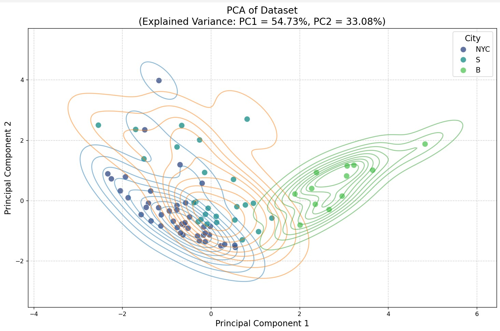
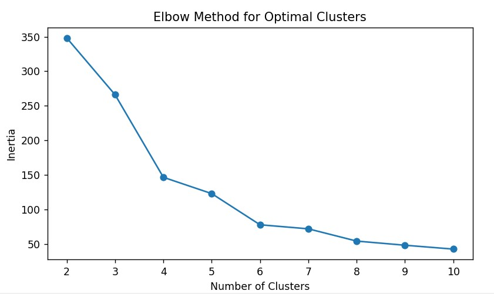
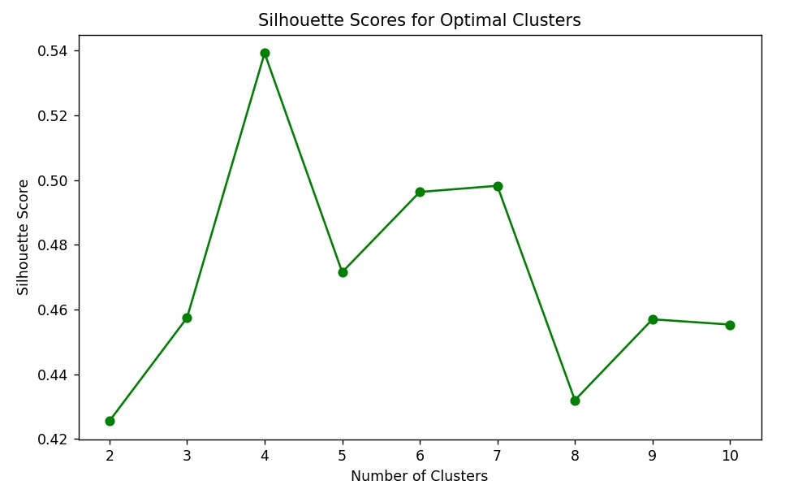
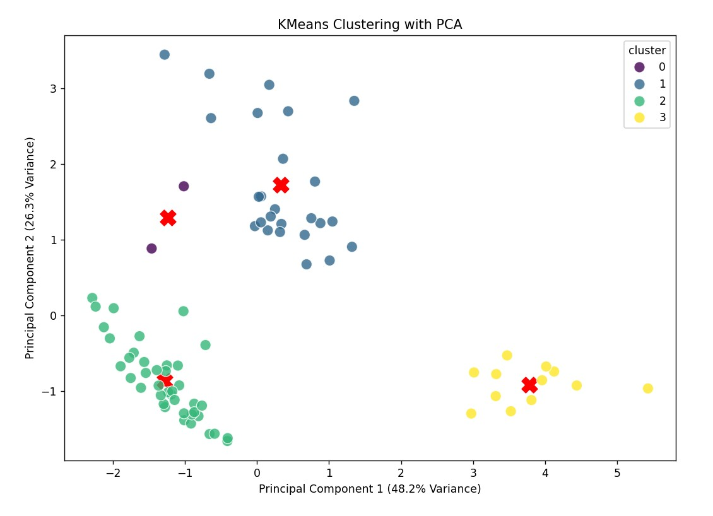
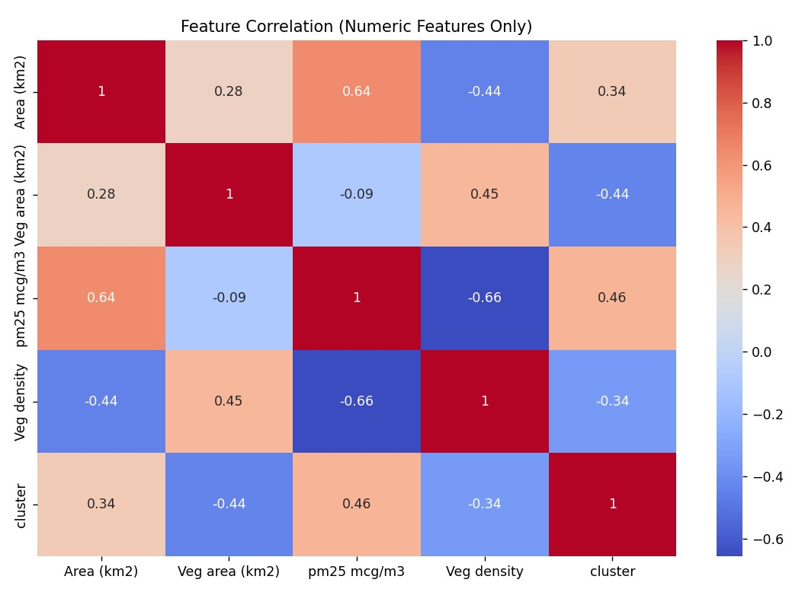

# Machine Learning Project : Urban neiborhoods living environment comparison

## Objectives
- Analyze the relationship between these variables and potentially predict or classify certain neighborhood characteristics.
- Understand the relationships between variables.
- Predict pollution.
- Identify groups of neighborhoods.

## Dataset

### Variables
- **Total area (km²)**
- **Vegetation area (km²)**
- **Fine particles pollution pm25 (mcg/m³)**
- **Vegetation density (data['Veg area (km2)'] / data['Area (km2)'])**

#### Additional Note
I intended to include the income variable to enrich the dataset further. However, due to time constraints and the unavailability of reliable data, this variable was not included.

### Description
- **79 neighborhoods/roundabouts** in 3 different cities:
  - **New York City**: 42
  - **Berlin**: 12
  - **Seoul**: 25

The data was collected from various sources by myself, I had to process them and put them in a single CSV file (`data/data.csv`).

### Data Sources
- **Surface area**: [Wikipedia](https://www.wikipedia.org/)

- **Seoul**: [Seoul Open Data Plaza](https://data.seoul.go.kr/dataService/boardList.do)
- **New York City**: [NYC Health](https://a816-dohbesp.nyc.gov/IndicatorPublic/)
- **Berlin**:
  - [Oasis Hub](https://oasishub.co/dataset/berlin-germany-district-level-environmental-database/resource/be1739c5-1c58-4199-be5a-ea6f15299cb5?inner_span=True)
  - [Berlin Environmental Data](https://www.berlin.de/sen/uvk/_assets/natur-gruen/stadtgruen/daten-und-fakten/ausw_14.pdf)

## Outliers

### Verification of Existing Outliers

Two methods were used to verify the presence of outliers in our dataset:

1. **IQR Calculations**

```python
def detect_outliers_iqr(data): 
    Q1 = np.percentile(data, 25, axis=0)
    Q3 = np.percentile(data, 75, axis=0)
    IQR = Q3 - Q1
    lower_bound = Q1 - 1.5 * IQR
    upper_bound = Q3 + 1.5 * IQR
    return (data < lower_bound) | (data > upper_bound)
```

2. **Isolation Forest Library**

```python
def detect_outliers_iforest(dataset): 
    # 5% of the data are outliers
    clf = IsolationForest(contamination=0.05) 
    clf.fit(dataset)
    return clf.predict(dataset) == -1
```

### Results

Both methods identified abnormal data, particularly concerning the area (km²). However, we decided to keep the outliers for the following reasons:
- The outliers correspond to legitimate values, such as larger areas like Steglitz-Zehlendorf and Treptow-Köpenick.
- When tested with pm25 (mcg/m³), the outliers were not significantly different from the other values (difference <1).
- The dataset is relatively small, so removing outliers would result in a loss of valuable information.

## Principal Component Analysis (PCA)

PCA is an unsupervised machine learning algorithm used for exploratory data analysis, dimensionality reduction, and information compression.

### Code Snippet

```python
from sklearn.decomposition import PCA

pca = PCA(n_components=2)
X_pca = pca.fit_transform(X_scaled)
data['PCA1'] = X_pca[:, 0]
data['PCA2'] = X_pca[:, 1]
```
### Vizualization

I've chosen a PCA with labels (cities) to combine an unsupervised exploratory approach with a supervised interpretation, facilitating the analysis of patterns and relationships in the data.



### Interpretation

- **PC1 (x-axis)**: Explains 54.73% of the total variance.
- **PC2 (y-axis)**: Explains 33.08% of the total variance.
- **Combined**: Together, they explain 87.81% of the total variance, which is sufficient for a good representation of the data in a reduced 2-dimensional space.

#### Dispersion of Points

- **NYC (dark blue)**: Points are fairly clustered near the center, indicating relative homogeneity of observations for this city. However, a few well-scattered points of the cloud can be seen.
- **Berlin (light green)**: Points are scattered on the right of the graph, forming a distinct group from the other cities.
- **Seoul (orange)**: Points lie between NYC and Berlin, forming a more dispersed cloud. Seoul's neighborhoods share overlapping characteristics with both NYC and Berlin, leading to a more dispersed cloud. This might indicate that Seoul has mixed traits or variability in the data.

## Clustering Analysis

### K-Means Clustering

To determine the optimal number of clusters (k), we use two methods: the Elbow Method and the Silhouette Score.
<p float="left">
    <div style="width: 45%; display: inline-block; vertical-align: top;">
        <h4>Elbow Method</h4>
        <p>The Elbow Method helps to find the optimal k-value by plotting the inertia against the number of clusters. Inertia is calculated as:</p>
        <p>Inertia = Σ (distance(x_i, c_j*))^2</p>
        <p>where c_j is the centroid of the cluster. We look for the inflection point on the graph where the curve begins to "bend". This point generally corresponds to the optimal number of clusters. Here, the elbow is around K=4.</p>
        
    </div>
    <div style="width: 45%; display: inline-block; vertical-align: top;">
        <h4>Silhouette Score</h4>
        <p>The Silhouette Score measures how similar a point is to its own cluster compared to other clusters. It is calculated as:</p>
        <p>Silhouette Score = (b - a) / max(a, b)</p>
        <p>where a is the average intra-cluster distance (the average distance between each point within a cluster) and b is the average inter-cluster distance (the average distance between all clusters). The highest score is 0.54 with K=4</p>
        
    </div>
</p>

K4-Means

code snippet:

optimal_clusters = 4 
kmeans = KMeans(n_clusters=optimal_clusters, random_state=42)
kmeans.fit(X_scaled)
pca = PCA(n_components=2)
X_pca = pca.fit_transform(X_scaled)
centroids = pca.transform(kmeans.cluster_centers_)
for i, centroid in enumerate(centroids):
    plt.scatter(*centroid, color='red', marker='X', s=200, label=f'Centroid {i}')
sns.scatterplot(x=X_pca[:, 0], y=X_pca[:, 1], hue=data['cluster'], palette='viridis', s=100, alpha=0.8)


classic visualization of K-means clustering results after dimensionality reduction by Principal Component Analysis (PCA)

Pour chaque cluster, calculez les moyennes, les écarts-types, les quartiles, etc. des variables initiales. Cela vous permettra d'identifier les caractéristiques qui différencient les clusters.




Heatmap




Surface et végétation: Il y a une corrélation positive modérée entre la surface d'un quartier et sa surface végétale. Cela suggère que les quartiers plus grands ont tendance à avoir une plus grande surface végétale.
Pollution et végétation: La corrélation entre la pollution (pm25) et la densité de végétation est négative. Cela indique que les quartiers avec une densité de végétation plus élevée ont tendance à avoir une pollution de l'air moins élevée. C'est une observation intéressante et conforme à l'intuition.

Pollution et surface: La corrélation entre la pollution et la surface est positive. Cela pourrait signifier que les quartiers plus grands ont tendance à être plus pollués. Cependant, il faudrait approfondir l'analyse pour confirmer cette hypothèse, car d'autres facteurs peuvent influencer la pollution.

Densité de végétation et pollution: La corrélation négative entre la densité de végétation et la pollution confirme l'observation précédente : plus la densité de végétation est élevée, moins la pollution est importante.


<!-->


 Explorer la séparation en clustering :

    Tester des algorithmes de clustering (K-means, DBSCAN) pour valider si les clusters correspondent bien aux villes.

c. Validation supervisée :

    Si les villes sont utilisées comme classes, entraîner un modèle supervisé et évaluer sa précision sur ces données.


Analyse Non Supervisée

    Clustering:
        Objectif: Regrouper les quartiers en fonction de leur similarité sur les variables.
        Algorithmes: K-means, DBSCAN, Hierarchical Clustering.
        Intérêt: Identifier des clusters de quartiers avec des caractéristiques environnementales similaires (par exemple, quartiers très verts avec une faible pollution, quartiers densément peuplés avec une forte pollution).
    Analyse en Composantes Principales (ACP):
        Objectif: Réduire la dimensionnalité des données et identifier les principales sources de variation.
        Intérêt: Visualiser les quartiers dans un espace à plus faible dimension pour mieux comprendre leurs relations.

Analyse Supervisée

    Régression:
        Objectif: Prédire la valeur de la pollution (pm2.5) en fonction de la superficie et de la surface végétalisée.
        Algorithmes: Régression linéaire, Régression Ridge, Régression Lasso, Arbres de régression, Forêts aléatoires.
        Intérêt: Comprendre l'impact de la superficie et de la surface végétalisée sur la qualité de l'air.
    Classification:
        Objectif: Classer les quartiers en fonction d'un critère (par exemple, quartiers à faible, moyenne ou forte pollution).
        Algorithmes: Régression logistique, Arbres de décision, Forêts aléatoires, SVM.
        Intérêt: Créer un modèle prédictif pour identifier les quartiers à risque en termes de pollution.

Guidage dans vos Choix

1. Définir votre objectif principal:

    Comprendre les relations: Si vous cherchez à comprendre les relations entre les variables, l'analyse en composantes principales et la régression linéaire sont de bons choix.
    Prédire la pollution: Pour prédire la pollution, la régression (linéaire, non-linéaire) est idéale.
    Identifier des groupes de quartiers: Le clustering vous permettra de regrouper les quartiers en fonction de leurs caractéristiques.

2. Préparer vos données:

    Nettoyage: Vérifier la présence de valeurs manquantes, d'outliers.
    Normalisation: Normaliser les variables si nécessaire (par exemple, si les échelles sont très différentes).
    Encodage: Si vous avez des variables catégorielles (par exemple, le nom de la ville), il faudra les encoder.

3. Choisir les bons algorithmes:

    Expérimenter: Tester différents algorithmes pour voir lequel donne les meilleurs résultats.
    Évaluer les performances: Utiliser des métriques appropriées (RMSE, MAE, précision, rappel, F1-score).
    Considérer la complexité: Pour les grands datasets, les algorithmes plus rapides (comme les arbres de décision ou les forêts aléatoires) peuvent être préférables.

4. Interpréter les résultats:

    Visualiser: Utiliser des graphiques pour mieux comprendre les résultats.
    Valider: Valider les modèles sur un jeu de données de test.
