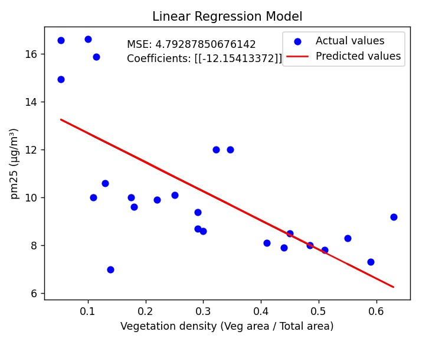
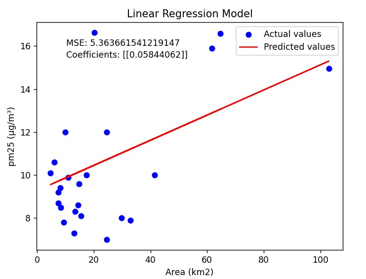

# Machine Learning Project : Urban neiborhoods living environment comparison

## Objectives
- Analyze the relationship between these variables and potentially predict or classify certain neighborhood characteristics.
- Identify predictive factors of pollution according to neighborhood characteristics.
- Explore relationships between vegetation density and fine pollution in a variety of urban contexts.
- Group neighborhoods according to similar characteristics to inform urban planning.


## Dataset

### Variables
- **Total area (km²)**
- **Vegetation area (km²)**
- **Fine particles pollution pm25 (mcg/m³)**
- **Vegetation density (data['Veg area (km2)'] / data['Area (km2)'])**

#### Additional Note
I intended to include the population density or income variable to enrich the dataset further. However, due to time constraints and the unavailability of reliable data, these variables were not included.

### Description
- **79 neighborhoods/roundabouts** in 3 different cities:
  - **New York City**: 42
  - **Berlin**: 12
  - **Seoul**: 25

The data was collected from various sources by myself, I had to process them and put them in a single CSV file (`data/data.csv`).

### Data Sources
- **Surface area**: [Wikipedia](https://www.wikipedia.org/)

- **Seoul**: [Seoul Open Data Plaza](https://data.seoul.go.kr/dataService/boardList.do)
- **New York City**: [NYC Health](https://a816-dohbesp.nyc.gov/IndicatorPublic/)
- **Berlin**:
  - [Oasis Hub](https://oasishub.co/dataset/berlin-germany-district-level-environmental-database/resource/be1739c5-1c58-4199-be5a-ea6f15299cb5?inner_span=True)
  - [Berlin Environmental Data](https://www.berlin.de/sen/uvk/_assets/natur-gruen/stadtgruen/daten-und-fakten/ausw_14.pdf)

## Outliers

### Verification of Existing Outliers

Two methods were used to verify the presence of outliers in our dataset:

1. **IQR Calculations**

```python
def detect_outliers_iqr(data): 
    Q1 = np.percentile(data, 25, axis=0)
    Q3 = np.percentile(data, 75, axis=0)
    IQR = Q3 - Q1
    lower_bound = Q1 - 1.5 * IQR
    upper_bound = Q3 + 1.5 * IQR
    return (data < lower_bound) | (data > upper_bound)
```

2. **Isolation Forest Library**

```python
def detect_outliers_iforest(dataset): 
    # 5% of the data are outliers
    clf = IsolationForest(contamination=0.05) 
    clf.fit(dataset)
    return clf.predict(dataset) == -1
```

### Results

Both methods identified abnormal data, particularly concerning the area (km²). However, we decided to keep the outliers for the following reasons:
- The outliers correspond to legitimate values, such as larger areas like Steglitz-Zehlendorf and Treptow-Köpenick.
- When tested with pm25 (mcg/m³), the outliers were not significantly different from the other values (difference <1).
- The dataset is relatively small, so removing outliers would result in a loss of valuable information.

## Principal Component Analysis (PCA)

PCA is an unsupervised machine learning algorithm used for exploratory data analysis, dimensionality reduction, and information compression.

### Code Snippet

```python
from sklearn.decomposition import PCA

pca = PCA(n_components=2)
X_pca = pca.fit_transform(X_scaled)
data['PCA1'] = X_pca[:, 0]
data['PCA2'] = X_pca[:, 1]
```
### Vizualization

I've chosen a PCA with labels (cities) to combine an unsupervised exploratory approach with a supervised interpretation, facilitating the analysis of patterns and relationships in the data.


### Interpretation

- **PC1 (x-axis)**: Explains 54.73% of the total variance.
- **PC2 (y-axis)**: Explains 33.08% of the total variance.
- **Combined**: Together, they explain 87.81% of the total variance, which is sufficient for a good representation of the data in a reduced 2-dimensional space.

#### Dispersion of Points

- **NYC (dark blue)**: Points are fairly clustered near the center, indicating relative homogeneity of observations for this city. However, a few well-scattered points of the cloud can be seen.
- **Berlin (light green)**: Points are scattered on the right of the graph, forming a distinct group from the other cities.
- **Seoul (orange)**: Points lie between NYC and Berlin, forming a more dispersed cloud. Seoul's neighborhoods share overlapping characteristics with both NYC and Berlin, leading to a more dispersed cloud. This might indicate that Seoul has mixed traits or variability in the data.

## Clustering Analysis

### K-Means Clustering

To determine the optimal number of clusters (k), we use two methods: the Elbow Method and the Silhouette Score.
### Elbow Method
The Elbow Method helps to find the optimal k-value by plotting the inertia against the number of clusters. Inertia is calculated as:

```
Inertia = Σ (distance(x_i, c_j*))^2
```

where c_j is the centroid of the cluster. We look for the inflection point on the graph where the curve begins to "bend". This point generally corresponds to the optimal number of clusters. Here, the elbow is around K=4.


### Silhouette Score
The Silhouette Score measures how similar a point is to its own cluster compared to other clusters. It is calculated as:

```
Silhouette Score = (b - a) / max(a, b)
```

where a is the average intra-cluster distance (the average distance between each point within a cluster) and b is the average inter-cluster distance (the average distance between all clusters). The highest score is 0.54 with K=4.


### K-Means Clustering

#### Code Snippet

```python
from sklearn.cluster import KMeans
from sklearn.decomposition import PCA
import matplotlib.pyplot as plt
import seaborn as sns

optimal_clusters = 4 
kmeans = KMeans(n_clusters=optimal_clusters, random_state=42)
kmeans.fit(X_scaled)

pca = PCA(n_components=2)
X_pca = pca.fit_transform(X_scaled)
centroids = pca.transform(kmeans.cluster_centers_)

for i, centroid in enumerate(centroids):
    plt.scatter(*centroid, color='red', marker='X', s=200, label=f'Centroid {i}')

sns.scatterplot(x=X_pca[:, 0], y=X_pca[:, 1], hue=data['cluster'], palette='viridis', s=100, alpha=0.8)
plt.title('K-Means Clustering Results after PCA')
plt.xlabel('PCA1')
plt.ylabel('PCA2')
plt.legend()
plt.show()
```

#### Visualization

The classic visualization of K-means clustering results after dimensionality reduction by Principal Component Analysis (PCA) is shown below:


#### Cluster Characteristics

| Cluster | Area (km²) | Veg Area (km²) | pm25 (mcg/m³) | Veg Density | City_B | City_NYC | City_S | PCA1 | PCA2 |
|---------|-------------|----------------|---------------|-------------|--------|----------|--------|------|------|
| 0       | 45.25       | 17.90          | 7.55          | 0.405       | 0.0    | 1.0      | 0.0    | -1.24| 1.29 |
| 1       | 24.21       | 6.65           | 10.80         | 0.270       | 0.0    | 0.0      | 1.0    | 0.33 | 1.72 |
| 2       | 10.24       | 3.30           | 9.14          | 0.318       | 0.0    | 1.0      | 0.0    | -1.28| -0.87|
| 3       | 74.31       | 4.48           | 15.88         | 0.072       | 1.0    | 0.0      | 0.0    | 3.78 | -0.92|

This table summarizes the characteristics of each cluster, providing insights into the average values of key variables for neighborhoods within each cluster.     
```markdown
### Cluster Distribution by City

The table below shows the distribution of neighborhoods from each city across the identified clusters:

| Cluster | Berlin | New York City | Seoul |
|---------|--------|---------------|-------|
| 0       | 0.0    | 2.0           | 0.0   |
| 1       | 0.0    | 0.0           | 25.0  |
| 2       | 0.0    | 40.0          | 0.0   |
| 3       | 12.0   | 0.0           | 0.0   |

As observed, the clusters are distinctly separated by cities. This separation may indicate differences in urban layout and planning, environmental factors, or variations in data collection methods across the cities.
```

## Heatmap Analysis

### Code Snippet

```python
import pandas as pd
import seaborn as sns
import matplotlib.pyplot as plt

numeric_features = data.select_dtypes(include=[float, int]).drop(columns=encoded_df.columns)
# Plot heatmap
plt.figure(figsize=(12, 8))
sns.heatmap(numeric_features.corr(), annot=True, cmap='coolwarm')
plt.title('Correlation Heatmap of Numeric Features')
plt.show()
```

### Visualization


### Surface Area
There is a moderate positive correlation between the surface area of a neighborhood and its pm25 particle concentration. This suggests that larger neighborhoods tend to be more polluted.

### Pollution and Vegetation
The correlation between pollution (pm25) and vegetation density is negative. This indicates that neighborhoods with higher vegetation density tend to have lower air pollution. This is an interesting and intuitive observation.

## Mean Squared Error (MSE) 

#### Code Snippet
```python
import numpy as np
from sklearn.model_selection import train_test_split
from sklearn.linear_model import LinearRegression
from sklearn.metrics import mean_squared_error

X_train, X_test, y_train, y_test = train_test_split(X, y, test_size=0.3, random_state=42)
model = LinearRegression()
model.fit(X_train, y_train)
y_pred = model.predict(X_test)
MSE = mean_squared_error(y_test, y_pred)
```
### Visualization




### Analysis

The calculated Mean Squared Error (MSE) values are relatively high, indicating a significant variance between the predicted and actual values. This suggests that the linear regression model may not be adequately capturing the underlying patterns in the data. Additionally, MSE is highly sensitive to outliers, which can disproportionately affect the results.

To improve the model's performance:
- **Model Complexity**: The current linear model may be too simplistic. Exploring non-linear models could provide better results.
- **Outlier Management**: Investigate and handle outliers appropriately to reduce their impact on the model's accuracy.

By addressing these aspects, the predictive accuracy of the model can be enhanced, leading to more reliable insights.


<!-->

JSON file
berlin  
    https://github.com/ljwolf/geopython/blob/master/data/berlin-neighbourhoods.geojson


A faire:

Spatialisation des données :

    Cartographier les clusters pour visualiser leur répartition géographique (utiliser folium ou geopandas pour générer des cartes interactives).
    Créer une matrice de distance entre les clusters pour observer la proximité des groupes en termes de caractéristiques environnementales.

Prédiction avancée : Tester des algorithmes non linéaires (Random Forest, Gradient Boosting, ou SVM) pour améliorer les prédictions de pollution.

OPTIONEL:
    PCA:
        Visualiser les contributions des variables initiales aux axes principaux.
        Comparer les résultats en gardant plus ou moins de dimensions (par exemple, 3 composantes principales au lieu de 2).
    clustering:
        Inclure une analyse des silhouettes pour chaque cluster (en termes de compacité et séparation).
        visualisation pour la Comparaison des distributions de pollution entre les clusters.
    MAE: (Mean Absolute Error) : Moins sensible aux outliers.
    Tester des modèles non linéaires ou d’ensemble comme Random Forest Regressor ou XGBoost pour améliorer les prédictions.